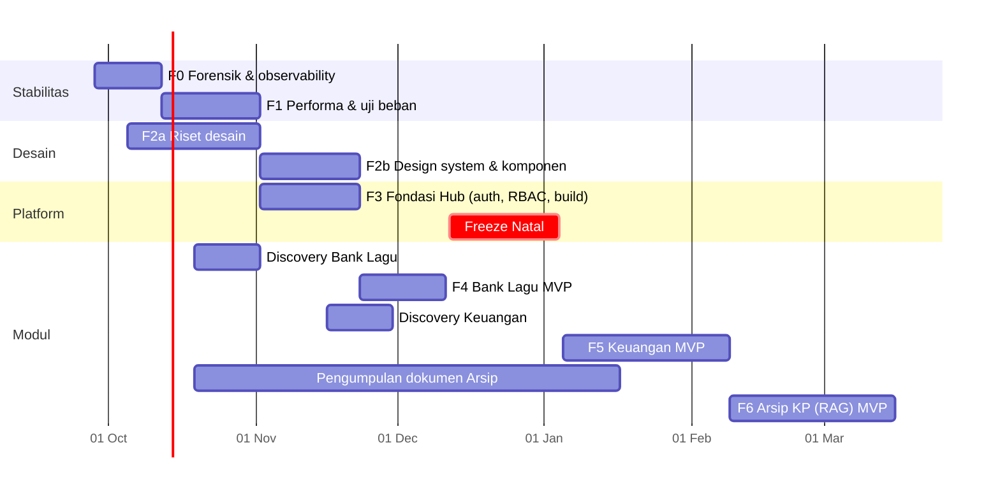
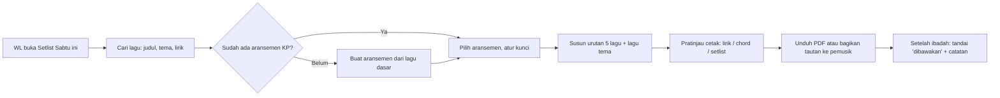
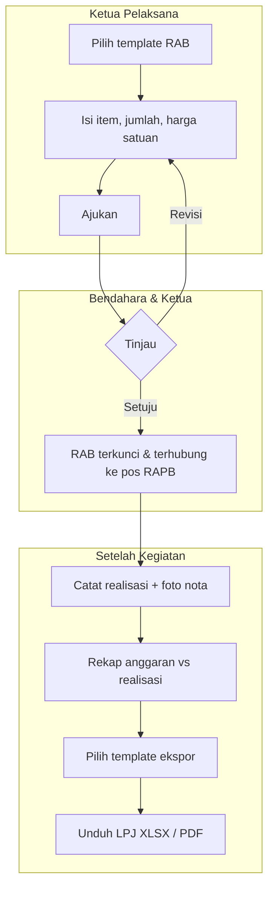
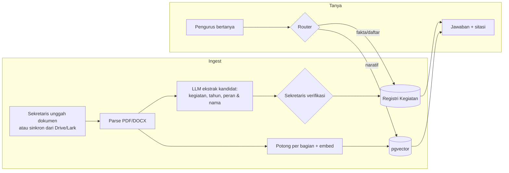

# KP Hub 3.0 — Master Plan

**Status:** Draf 1 · 24 September 2026 · Jose Taneo
**Lingkup:** stabilitas & observability, redesign menyeluruh, dan tiga modul baru (Bank Lagu, Keuangan, Arsip KP)
**Dokumen turunan:** tiap modul baru mendapat PRD sendiri di `docs/v3/prd/` setelah fase discovery-nya selesai. Dokumen ini menentukan urutan kerja dan pertanyaan yang harus dijawab setiap PRD, tetapi tidak menggantikan PRD itu sendiri.

---

## 1. Ringkasan

Versi 2.0 membuktikan satu hal: absensi wajah bisa dipakai di ibadah Sabtu. Gibbor membuktikan hal lain: saat perangkat dan orang bertambah, sistem ini goyah, dan kita tidak punya data untuk menjelaskan kenapa.

Karena itu 3.0 dikerjakan berurutan, bukan sekaligus:

1. **Lihat dulu.** Pasang monitoring dan logging agar insiden berikutnya meninggalkan jejak.
2. **Kokohkan.** Perbaiki penyebab lambat dan down yang terbukti dari data, lalu uji beban dengan simulasi acara besar.
3. **Rancang ulang.** Riset desain dan design system baru dikerjakan *sebelum* modul baru dibangun, supaya modul baru tidak dibangun dua kali.
4. **Bangun fondasi.** Login per pengurus dan hak akses per peran. Tanpa ini, modul Keuangan dan Arsip tidak aman diluncurkan.
5. **Tambah modul**, satu per satu: Bank Lagu → Keuangan → Arsip KP (RAG).

Urutan ini sengaja menunda fitur baru sekitar dua bulan. Menambah tiga modul di atas server yang belum kita pahami perilakunya hanya akan menambah jumlah hal yang bisa rusak saat Natal.

---

## 2. Kondisi sekarang: temuan dari kode

Bagian ini ditulis dari membaca kode, bukan dari log produksi (belum ada log yang tersimpan). Setiap poin adalah **hipotesis yang perlu dibuktikan di Fase 0**, bukan kesimpulan.

### 2.1 Kenapa backend terasa down saat Gibbor

> **Pembaruan 26 September 2026: forensik selesai.** Lihat [postmortem-gibbor-2026.md](postmortem-gibbor-2026.md). Ringkasnya: H1 **gugur** (server 1 vCPU / 2 GB, RAM tersedia 895 MB, tidak ada OOM, proses tidak pernah restart), H2 **gugur** (nol 429, perangkat memakai data seluler), H4 kemungkinan besar gejala ikutan. Penyebab utama adalah hipotesis baru, **H5**: handler `async` (terutama `/api/register`) memanggil Supabase secara sinkron di event loop satu-satunya proses uvicorn, diperparah koneksi HTTP/2 ke Supabase yang putus dengan timeout 120 detik. Akibatnya server membeku, bukan mati. Perbaikannya ada di branch `feature/v3-f0-observability`. Tabel di bawah dipertahankan sebagai catatan hipotesis awal.

| # | Temuan | Lokasi | Kenapa relevan |
|---|---|---|---|
| H1 | Server berjalan dengan **2 worker gunicorn**, dan tiap worker memuat model InsightFace `buffalo_l` (det 640×640) sendiri-sendiri, di VPS yang dikomentari sebagai **RAM 2 GB + swap 4 GB**. | `scripts/deploy_vps.sh`, `face_service.py` | Dua salinan model bisa menghabiskan sebagian besar RAM. Saat banyak foto masuk bersamaan, sistem mulai memakai swap di disk, dan respons melambat drastis. Dari sisi pengguna, gejalanya terlihat seperti "server mati". |
| H2 | Rate limit dihitung **per alamat IP**: `/api/recognize` 30/menit, `/api/attendance/manual-checkin` 30/menit, `/api/users/search` 60/menit. | `routers/kiosk.py:52`, `:201`, `:214` | Saat Gibbor ada ±16 perangkat panitia. Jika semuanya memakai Wi-Fi gereja, di mata server mereka adalah **satu IP**. Artinya 16 perangkat berbagi jatah 30 scan per menit. Setelah jatah habis, server membalas 429 dan kiosk terlihat gagal. |
| H3 | Satu check-in wajah menjalankan **±5 query Supabase berurutan** (match, link info, cek hari ini, riwayat penuh, insert), ditambah inferensi model. | `routers/kiosk.py:80-190` | Latensi setiap query ke Supabase ikut dijumlahkan. `get_user_history` mengambil **seluruh** riwayat hadir orang itu hanya untuk dihitung jumlahnya. |
| H4 | Lark dan backend "sama-sama tidak bisa diakses" pada waktu yang sama. | `frontend/js/lark-overlay.js` | Form Lark dimuat langsung dari server Lark, bukan lewat VPS kita. Jika keduanya gagal bersamaan, penyebab yang paling mungkin ada di **sisi klien**: Wi-Fi atau sinyal di venue, DNS, atau HP yang kehabisan memori. Server kita belum tentu penyebabnya. Tanpa pemantauan dari luar, dua kemungkinan ini tidak bisa dibedakan. |

H4 penting: bisa jadi server sebenarnya sehat saat itu. Fase 0 menjawabnya dengan mencocokkan waktu kejadian ke log Sentry dan `journalctl`.

### 2.2 Kenapa web terasa lemot di HP pengurus

| # | Temuan | Lokasi | Dampak |
|---|---|---|---|
| F1 | Semua halaman memuat **Tailwind Play CDN** (`cdn.tailwindcss.com`). | `frontend/*.html` | Script ini mengompilasi CSS **di dalam browser** setiap kali halaman dibuka dan terus memantau perubahan DOM. Dokumentasi Tailwind sendiri menyatakan script ini tidak ditujukan untuk produksi. Di HP RAM kecil, ini beban CPU yang terus berjalan. |
| F2 | Halaman kiosk menjalankan **kamera + MediaPipe (WASM) + Tailwind runtime + iframe Lark** sekaligus. | `frontend/index.html` | Ini kombinasi terberat di seluruh aplikasi, dan justru berjalan di HP pribadi panitia. Browser mobile bisa mematikan iframe atau tab saat memori habis. |
| F3 | `dashboard.html` berukuran **107 KB dalam satu file** (HTML + JS inline), plus Chart.js, Moment.js + locale, SweetAlert2, semuanya dari CDN tanpa bundling. | `frontend/dashboard.html` | Semua kode dashboard di-parse di awal, termasuk kode untuk tab yang tidak dibuka. |
| F4 | `/api/all-logs` dan `/api/users` (dengan `attendance_logs(count)`) mengambil **seluruh data tanpa batas atau paginasi**. | `services/db_service.py:10`, `:135` | Ukuran respons bertambah setiap minggu. Dalam setahun, dashboard akan makin lambat dengan sendirinya. |
| F5 | Semua aset statis memakai `Cache-Control: no-cache`. | `main.py` | Aturan ini benar untuk mencegah JS usang, tetapi setiap aset tetap menunggu validasi ke server. Di jaringan venue yang lambat, jeda ini terasa. Solusi yang lebih tepat adalah nama file ber-hash dengan cache panjang, yang baru bisa diterapkan setelah ada build step. |

### 2.3 Observability yang sudah ada dan yang belum

**Sudah ada:** Sentry di backend (error 100%, trace 10%), pelapor error dari browser (`frontend/js/observability.js` → `/api/client-error`), endpoint `/health` yang mengecek DB dan model, tag `release` per commit.

**Belum ada:**
- Pemantauan dari luar yang mengecek setiap menit apakah situs bisa diakses. Tanpa ini, pertanyaan "server down atau jaringan venue?" tidak bisa dijawab.
- Metrik host: RAM, swap, CPU, disk. H1 hanya bisa dibuktikan dengan data ini.
- Log terstruktur yang tersimpan dan bisa dicari. Log saat ini hanya ada di journald dan `print()`.
- Data performa dari perangkat pengguna: Web Vitals, model dan RAM perangkat, waktu muat per halaman.
- Rincian waktu per tahap check-in (embedding, match, DB) yang tercatat. Saat ini hanya ada `print(... ms)`.

### 2.4 Keterbatasan fondasi untuk modul baru

- **Login admin memakai satu password bersama** (`routers/auth.py`). Semua pengurus masuk sebagai `"admin"`. Modul Keuangan butuh jejak siapa mengubah apa, dan Arsip berisi data pribadi. Keduanya tidak bisa dibangun di atas model akses ini.
- **Tidak ada build step frontend.** Tanpa build step, design system yang konsisten, bundle yang dipecah per halaman, dan cache ber-hash tidak bisa diterapkan.
- Semua beban kerja berada dalam satu proses: model wajah, API, dan (nanti) pemrosesan dokumen RAG. Jika pemrosesan PDF berjalan saat ibadah, antrian absen ikut melambat.

---

## 3. Prinsip 3.0

1. **Absensi Sabtu adalah jalur suci.** Modul baru tidak boleh berbagi proses, memori, atau jendela deploy dengan jalur check-in. Aturan lama tetap berlaku: target <150 ms, fallback manual 1 tap, `checkin_method` terpisah, TOCTOU.
2. **Setiap keputusan performa didasarkan pada angka.** Optimasi dimulai setelah ada data, bukan dari dugaan.
3. **Desain untuk HP kelas menengah di Wi-Fi gereja**, bukan laptop pengembang. Anggaran performa diukur di perangkat nyata milik pengurus.
4. **Pengurus login sebagai dirinya sendiri.** Ini berbeda dari non-goal v2 "login individual jemaat", yang tetap non-goal di 3.0.
5. **Satu modul selesai dan dipakai sebelum modul berikutnya dimulai.** "Dipakai" berarti ada pengguna nyata selama minimal dua minggu.

---

## 4. Roadmap

Kalender di bawah adalah usulan. Dua patokan yang perlu diperhatikan: **Natal 2026** (persiapan Nov–Des, hindari rilis berisiko) dan **siklus anggaran KP** (perlu dikonfirmasi, lihat §10).

Tiga jalur berjalan paralel karena tidak saling menunggu: stabilitas (kode backend), riset desain (wawancara, audit visual), dan **pengumpulan dokumen Arsip**. Pengumpulan dokumen adalah pekerjaan non-teknis yang paling lama, jadi harus dimulai paling awal.

Bank Lagu dijadwalkan sebelum freeze Natal karena kebutuhan aransemen Natal adalah ujian nyata pertama modul ini. Jika F2b atau F3 terlambat, Bank Lagu mundur ke Januari. Bank Lagu tidak dibangun di atas desain lama.

---

## 5. Fase 0 — Forensik & observability (2 minggu)

**Tujuan:** insiden berikutnya bisa dijelaskan dalam 15 menit dari data, bukan dari ingatan.

### 5.1 Forensik Gibbor (minggu 1)
1. Tentukan **tanggal dan jam** kejadian sepresisi mungkin dari foto, chat panitia, atau ingatan.
2. Tarik issue Sentry dan trace di rentang waktu itu. Cari 429 (H2), timeout, dan lonjakan durasi.
3. Tarik `journalctl -u faceid --since ... --until ...` di VPS. Cari restart worker, `MemoryError`, dan OOM killer (`dmesg | grep -i oom`).
4. Jika log sudah terhapus (journald bisa merotasi), catat itu sebagai temuan: retensi log adalah kebutuhan.
5. Tulis **post-mortem satu halaman** (`docs/v3/postmortem-gibbor-2026.md`): kronologi, penyebab yang terbukti, penyebab yang tidak bisa dibuktikan, dan tindakan.

### 5.2 Paket observability minimum
| Lapisan | Alat yang direkomendasikan | Menjawab pertanyaan |
|---|---|---|
| Uptime dari luar | **Sentry Uptime Monitoring** mengecek `/health` setiap 1 menit dari luar. Alternatif: UptimeRobot (gratis). Alert ke Telegram atau email. | "Server down, atau jaringan venue?" |
| Metrik host | **Grafana Alloy → Grafana Cloud (free tier)**: RAM, swap, CPU, disk, jumlah proses. Alternatif satu perintah: Netdata. | "Apakah server kehabisan memori?" (H1) |
| Log terstruktur | Log JSON (stdlib `logging` + formatter JSON) dengan `request_id`, `route`, `status`, `duration_ms`, `device_id`. Dikirim ke Grafana Loki (paket yang sama). Retensi ≥30 hari. | "Apa yang terjadi pukul 17:04 tadi?" |
| Rincian check-in | Sentry span per tahap: `decode`, `embedding`, `match`, `db.*`. Menggantikan `print(... ms)`. | "Tahap mana yang lambat?" |
| Perangkat pengguna | Sentry Browser SDK + Web Vitals (LCP, INP, CLS), ditambah tag `navigator.deviceMemory`, `hardwareConcurrency`, dan halaman. | "HP mana yang lemot, dan karena apa?" |
| Identitas perangkat kiosk | Label perangkat (misalnya `kiosk-03`) disimpan di localStorage dan dikirim sebagai header. | "Kiosk mana yang bermasalah?" |

Satu dashboard Grafana berjudul **"Hari Ibadah"** menampilkan dalam satu layar: RAM/swap, request per menit, p95 check-in, error rate, dan status uptime. Dashboard ini dibuka di laptop panitia multimedia setiap Sabtu dan acara besar.

### 5.3 SLO awal
- Ketersediaan `/health` selama jendela ibadah (16:30–17:15) dan acara besar: **≥99,5%**
- p95 `/api/recognize` di server: **<800 ms** (target 150 ms adalah waktu model saja; angka end-to-end ditetapkan ulang setelah pengukuran pertama)
- Error rate check-in (5xx + 429): **<1%**

**Kriteria selesai Fase 0:** post-mortem Gibbor terbit, dashboard "Hari Ibadah" terisi data dari minimal satu ibadah Sabtu, alert uptime terbukti sampai ke HP (uji dengan mematikan service di jam sepi).

---

## 6. Fase 1 — Performa & uji beban (3 minggu)

### 6.1 Uji beban backend
Skenario disimulasikan dengan **k6** atau **Locust** terhadap staging (bukan produksi):

| Skenario | Profil |
|---|---|
| Sabtu biasa | 100 check-in dalam 45 menit, puncak 8/menit, 2 kiosk |
| Acara besar (ulang Gibbor) | 16 perangkat, 200 check-in + 60 registrasi dalam 60 menit, semuanya dari **satu IP** |
| Lonjakan | 10 foto masuk bersamaan dalam 1 detik |

Yang dicatat: p50/p95/p99, jumlah 429, RAM dan swap, serta apakah worker restart.

### 6.2 Perbaikan yang kemungkinan besar dibutuhkan
Semua ini baru dikerjakan setelah angka dari uji beban tersedia:

- **Pisahkan proses model wajah dari API.** Satu proses `face-worker` memegang satu salinan model, sementara API ringan boleh punya beberapa worker. Ini juga menjadi pola untuk worker RAG nanti.
- **Evaluasi model yang lebih ringan atau det_size lebih kecil.** Kiosk sudah mengirim foto yang terpusat di wajah, jadi `det_size=(640,640)` mungkin berlebihan. Keputusan diambil berdasarkan uji akurasi pada data wajah asli: bandingkan distribusi similarity sebelum dan sesudah.
- **Rate limit per perangkat, bukan per IP**, untuk perangkat yang sudah dipasangkan (token kiosk). IP tetap dipakai untuk permintaan anonim.
- **Pangkas query check-in:** hitung jumlah hadir dengan `count`, bukan dengan mengambil seluruh riwayat. Idealnya jadikan satu RPC Postgres yang mengerjakan cek, insert, dan statistik dalam satu round-trip, sekaligus mempertahankan proteksi TOCTOU lewat unique constraint.
- **Paginasi** `/api/all-logs` dan `/api/users`.
- **Upgrade VPS ke 4 GB** jika pemisahan proses belum cukup. Biaya tambahan ini jauh lebih murah daripada satu acara besar yang gagal.

### 6.3 Audit frontend
1. **Inventaris perangkat pengurus:** formulir singkat berisi model HP, RAM, browser, dan versi OS. Dari situ dipilih 3 perangkat acuan (terlemah, median, terkuat).
2. **Ukur** dengan Lighthouse (profil mobile, CPU 4× throttle) dan rekaman Performance DevTools di perangkat acuan terlemah, untuk kiosk, dashboard, register, dan photobooth.
3. **Perbaikan cepat yang tidak menunggu redesign:** ganti Tailwind Play CDN dengan CSS hasil kompilasi (Tailwind CLI, tanpa mengubah markup), host MediaPipe secara lokal, dan hilangkan Moment.js (cukup `Intl.DateTimeFormat`).
4. **Anggaran performa** yang berlaku untuk desain baru:
   - LCP < 2,5 s di perangkat acuan terlemah, jaringan 4G lambat
   - JS per halaman < 150 KB (gzip), selain MediaPipe di kiosk
   - Tidak ada long task > 200 ms saat kamera kiosk aktif

**Kriteria selesai Fase 1:** skenario "ulang Gibbor" lulus SLO di staging, anggaran performa terpenuhi di perangkat terlemah, dan hasilnya tercatat dalam laporan sebelum/sesudah.

---

## 7. Fase 2 — Riset desain & design system baru (7 minggu, paralel)

"Terlalu AI slop" perlu diurai dulu menjadi masalah yang bisa diperbaiki. Fase ini tidak dimulai dengan memilih warna.

### 7.1 Riset (4 minggu)
| Kegiatan | Output |
|---|---|
| **Audit UI sekarang:** screenshot setiap layar dan state, lalu tandai pola generik (gradient tanpa fungsi, glassmorphism, badge berlebihan, animasi dekoratif, copy yang kaku). | Katalog masalah dengan contoh visual |
| **Observasi lapangan:** amati 1 ibadah Sabtu dari posisi kiosk dan 1 rapat pengurus yang memakai dashboard. | Catatan friksi nyata: di mana orang ragu, salah tekan, atau menunggu |
| **Wawancara 5–6 pengurus** dari peran berbeda (ketua, bendahara, Pemerhati, multimedia, persekutuan). | Kebutuhan per peran, bahasa yang mereka pakai |
| **Riset referensi:** produk nyata yang berhasil terasa manusiawi, misalnya Linear, Things, Arc, Are.na, dan aplikasi gereja atau komunitas yang baik. Bukan galeri Dribbble. | Moodboard beranotasi: *kenapa* setiap referensi berhasil |
| **Identitas KP:** logo, warna, tipografi, dan tema tahunan yang sudah dipakai divisi multimedia. | Batasan brand yang harus dihormati |

### 7.2 Design system (3 minggu)
- **Prinsip desain** (3–5 kalimat yang bisa dipakai untuk memutus debat desain).
- **Token tiga lapis:** primitif (skala warna, spasi, radius) → semantik (`surface`, `text-muted`, `danger`) → komponen. Diterbitkan sebagai CSS custom properties sehingga berlaku di kiosk, Hub, dan photobooth.
- **Tipografi dan kepadatan:** mode *Kiosk* (besar, dibaca dari jarak 1 m) dan mode *Hub* (padat, untuk kerja).
- **Prinsip gerak:** animasi hanya untuk menjelaskan perubahan state, durasi pendek, dan menghormati `prefers-reduced-motion`.
- **Pustaka komponen minimum:** tombol, input, tabel, dialog, toast, tab, kartu, empty state, skeleton, dan pola formulir panjang (dibutuhkan Keuangan).
- **Copy guideline berbahasa Indonesia:** nada, istilah baku (misalnya "Hadir", "Anggota", "Pengurus"), serta pola pesan error dan empty state.

**Alat:** Figma untuk eksplorasi dan komponen (konektor Figma di sesi ini perlu diotorisasi ulang, dan Figma Desktop sedang tidak tersambung), skill `anti-ai-slop-design` dan `ui-ux-pro-max` sebagai checklist, dan prototipe HTML untuk menguji interaksi di HP asli.

**Pengganti "Fluid Clarity":** keputusan dipertahankan, dirombak, atau diganti diambil di akhir riset, bukan sekarang. `DESIGN.md` diperbarui setelahnya.

**Kriteria selesai Fase 2:** 3 layar kunci (kiosk sukses, beranda Hub, satu layar modul baru) diuji dengan 5 pengguna di HP mereka sendiri, dan tidak ada tugas yang gagal diselesaikan.

---

## 8. Fase 3 — Fondasi Hub (3 minggu)

| Komponen | Isi |
|---|---|
| **Akun pengurus** | Login per orang (email + magic link lewat Supabase Auth, atau Google/Lark SSO bila tersedia). Password bersama dihapus. |
| **RBAC** | Peran: `ketua`, `bendahara`, `sekretaris`, `pemerhati`, `persekutuan`, `multimedia`, `pembina`, `admin-teknis`. Hak diatur per modul (lihat, ubah, setujui). Ditegakkan di Postgres dengan RLS, bukan hanya di UI. |
| **Audit log** | Tabel `audit_events` yang mencatat siapa, kapan, apa, dan nilai sebelum/sesudah. Wajib untuk Keuangan. |
| **Build frontend** | Vite multi-page: kiosk tetap vanilla dan ringan, sementara Hub memakai framework komponen ringan (keputusan D2). Output ber-hash dengan cache panjang, sehingga F5 terselesaikan. |
| **Shell Hub** | Navigasi modul, beranda per peran, halaman profil. Dashboard absensi yang sekarang dipindah menjadi modul pertama di dalamnya. |
| **Penyimpanan file** | Supabase Storage dengan bucket per modul dan kebijakan akses per peran. |
| **Pemisahan proses** | `api`, `face-worker`, dan (nanti) `jobs-worker` untuk ekspor PDF dan pemrosesan dokumen. |

Kiosk, registrasi, dan photobooth **tetap tanpa login** untuk jemaat.

---

## 9. Modul baru — konsep & PRD v0

Setiap modul di bawah adalah **PRD v0**: latar belakang dan asumsi yang masih harus diuji di discovery. Semua yang bertanda **[asumsi]** wajib dikonfirmasi lewat wawancara sebelum PRD v1 ditulis. PRD v1 menggunakan templat yang sama: Latar belakang → Masalah → Pengguna → Tujuan & Non-goal → Metrik → Alur → Kebutuhan fungsional → Model data → Risiko → Rilis.

### 9.1 Bank Lagu & Aransemen KP

**Latar belakang.** Setiap Sabtu tim persekutuan menyiapkan 5 lagu (1 penyembahan, 3 pujian, 1 penyembahan) ditambah lagu tema tahunan. Lirik, chord, dan aransemen tersebar di grup chat, Google Drive pribadi, dan ingatan pemusik. **[asumsi]** Setiap pergantian pengurus, pengetahuan aransemen ikut hilang, dan setiap minggu ada pekerjaan berulang: mencari chord, menyesuaikan kunci dengan WL, dan memformat lembar cetak.

**Masalah inti.** Tim musik tidak punya sumber tunggal yang bisa dipercaya untuk lagu yang pernah dibawakan KP, termasuk *versi KP-nya* (kunci, struktur, catatan aransemen). Menyiapkan lembar cetak juga masih dikerjakan manual setiap minggu.

**Pengguna.** Pemimpin pujian (WL), pemusik, sie persekutuan, dan operator multimedia (untuk lirik di layar).

**Pekerjaan yang ingin diselesaikan (JTBD).**
- "Saat menyusun daftar lagu minggu ini, saya ingin melihat lagu yang sudah pernah dan belum lama dibawakan, supaya variasinya terjaga."
- "Saat latihan, saya ingin lembar chord dalam kunci yang kami pakai, bukan kunci aslinya."
- "Saat mempersiapkan Natal, saya ingin menemukan aransemen yang dipakai tahun lalu beserta catatannya."

**MVP.**
- Katalog lagu: judul, pencipta, sumber (KJ/PKJ/NKB/lagu kontemporer), kunci asli, tempo, tema, dan tautan referensi (YouTube/Spotify).
- Lirik dan chord disimpan dalam format **ChordPro**. Format ini standar, bisa ditranspose otomatis, dan bisa dirender ke beberapa tampilan.
- **Aransemen** sebagai entitas terpisah dari lagu: satu lagu bisa punya banyak aransemen (kunci, struktur seperti `I–V1–C–V2–C–B–C×2–O`, instrumen, catatan).
- **Setlist per ibadah atau acara**, menarik aransemen tertentu. Riwayat terbentuk otomatis dari setlist ("terakhir dibawakan 3 minggu lalu").
- **Cetak dan ekspor:** lembar lirik, lembar chord (dengan transpose), dan satu PDF setlist lengkap, dirender di browser dengan CSS cetak. Template bisa diatur: ukuran font, 1 atau 2 kolom, dan tampil atau sembunyikan chord.

**Non-goal MVP.** Notasi balok, rekaman audio, presentasi ke proyektor (evaluasi di v1.1: ekspor ke format yang dipakai operator multimedia), dan akses publik.

**Metrik keberhasilan.** Waktu menyiapkan lembar cetak mingguan turun dari **[ukur saat discovery]** menjadi <10 menit. ≥80% setlist Sabtu dibuat di Hub dalam 8 minggu setelah rilis. Seluruh lagu yang dibawakan dalam 1 tahun terakhir sudah masuk katalog.

**Risiko.**
- **Hak cipta lirik.** Lirik KJ/PKJ/NKB dan lagu kontemporer dilindungi hak cipta. Modul ini harus **internal**: hanya pengurus yang login yang bisa melihatnya, tidak ada tautan publik, dan tidak diindeks mesin pencari. Status lisensi (misalnya CCLI) perlu ditanyakan ke majelis atau komisi musik gereja.
- **Migrasi awal.** Katalog kosong tidak ada gunanya. Butuh sesi "input massal" bersama tim musik (target 100 lagu pertama), sebaiknya dengan impor dari teks ChordPro atau format umum situs chord.

**Discovery (2 minggu).** Wawancara 2 WL, 2 pemusik, dan 1 operator multimedia. Kumpulkan 10 contoh lembar cetak yang pernah dipakai. Ukur waktu persiapan saat ini. Ketahui juga tempat penyimpanan lagu sekarang.

### 9.2 Keuangan KP

**Latar belakang.** Bendahara menyusun anggaran tahunan dan anggaran per kegiatan, mencatat realisasi, lalu menyusun laporan pertanggungjawaban untuk majelis. **[asumsi]** Saat ini semua itu dikerjakan di spreadsheet yang disalin dari tahun ke tahun, dengan format yang berubah-ubah per ketua pelaksana. Rekap tahunan masih disusun dengan menyalin data dari banyak file.

**Masalah inti.** Data anggaran tersebar di banyak file dengan format berbeda. Karena itu bendahara (1 orang) menjadi hambatan untuk setiap pertanyaan "sisa anggaran kita berapa?", dan laporan akhir memakan waktu lama untuk dirapikan.

**Pengguna.** Bendahara (pemilik), ketua pelaksana kegiatan (pengaju anggaran), ketua KP (penyetuju), dan pembina (peninjau).

**JTBD.**
- "Sebagai ketua pelaksana, saya ingin mengajukan RAB kegiatan dengan format yang sudah benar, supaya tidak bolak-balik direvisi."
- "Sebagai bendahara, saya ingin semua realisasi tercatat di satu tempat beserta buktinya, supaya LPJ bisa disusun otomatis."
- "Sebagai bendahara, saya ingin mengekspor laporan dalam format yang diminta majelis, tetapi tetap bisa mengubah kop, urutan, dan penandatangan."

**MVP.**
- **Anggaran tahunan (RAPB)** berisi pos dan sub-pos, disusun per sie atau kegiatan.
- **RAB per kegiatan** dibuat dari template dan terhubung ke pos di RAPB. Alurnya: draft → diajukan → disetujui → ditutup.
- **Realisasi:** baris pengeluaran/pemasukan dengan unggahan bukti (foto nota), terhubung ke item RAB.
- **Rekap otomatis:** anggaran vs realisasi per pos, per kegiatan, dan per periode, dengan penanda saat realisasi melewati anggaran.
- **Ekspor yang bisa diatur:** XLSX (untuk diolah lanjut) dan PDF (untuk tanda tangan). Template ekspor menyimpan kop, logo, kolom yang tampil, urutan, dan blok tanda tangan. Template dibuat sekali, lalu dipakai berulang.
- **Audit log** untuk setiap perubahan angka. Baris tidak pernah dihapus permanen, hanya dibatalkan dengan jejak.

**Non-goal MVP.** Integrasi rekening bank, pembayaran, pajak, dan akuntansi berpasangan (double-entry). Jika belakangan dibutuhkan, itu proyek tersendiri.

**Metrik keberhasilan.** Waktu menyusun LPJ satu kegiatan turun dari **[ukur]** menjadi <30 menit. Pertanyaan "sisa anggaran" bisa dijawab siapa pun yang berhak tanpa bertanya ke bendahara. 100% kegiatan periode berjalan tercatat di Hub.

**Risiko.**
- **Format wajib dari gereja.** Jika majelis punya format baku, template ekspor harus bisa menirunya persis. Kumpulkan contoh format resmi di minggu pertama discovery.
- **Kepercayaan.** Bendahara baru mau berhenti memakai spreadsheet jika ekspornya setara atau lebih baik. Jalankan paralel selama satu kegiatan sebelum spreadsheet ditinggalkan.
- **Keamanan data.** Data keuangan hanya bisa diakses peran tertentu dengan RLS, dan bukti nota disimpan di bucket privat.

**Discovery (2 minggu).** Duduk bersama bendahara selama satu sesi penuh menyusun laporan (observasi, bukan wawancara saja). Kumpulkan RAPB tahun lalu, 3 contoh RAB, 2 contoh LPJ, dan format resmi dari majelis. Wawancara 2 mantan ketua pelaksana.

### 9.3 Arsip KP — tanya-jawab dokumen kegiatan (RAG)

**Latar belakang.** Setiap kegiatan menghasilkan dokumen: proposal, konsep acara, rundown, susunan panitia dan pelayan, notulen evaluasi, dan LPJ. **[asumsi]** Dokumen ini tersebar di Drive pribadi, Lark, dan grup chat, lalu hilang saat pengurus berganti. Pengurus baru mengulang kesalahan yang sama karena evaluasi tahun lalu tidak bisa ditemukan.

**Masalah inti.** Pengetahuan institusional KP tidak bertahan melewati satu periode kepengurusan.

**Pengguna.** Seluruh pengurus (baca), sekretaris (pengelola arsip), dan ketua pelaksana (penanya utama saat merencanakan acara).

**Contoh pertanyaan target:**
- "Siapa ketua pelaksana Natal 2025?" → **fakta terstruktur**
- "Siapa saja pelayan Gibbor 2026?" → **daftar terstruktur**
- "Konsep Natal 2025 seperti apa?" → **ringkasan naratif**
- "Apa evaluasi terbesar dari retret tahun lalu?" → **ringkasan naratif**

**Keputusan desain penting.** Dua jenis pertanyaan di atas butuh mekanisme berbeda. Pertanyaan "siapa saja pelayan X" **tidak andal** jika dijawab dengan RAG murni atas potongan teks, karena daftar nama sering terpecah di beberapa potongan dan model akan menjawab sebagian dengan yakin. Karena itu arsitekturnya **hibrida**:

1. **Registri Kegiatan (terstruktur):** tabel `events` (nama, tahun, tanggal, tema) dan `event_roles` (kegiatan, peran, orang). Saat dokumen diunggah, LLM mengekstrak kandidat data ini, lalu **sekretaris memverifikasi** sebelum data disimpan.
2. **RAG dokumen (naratif):** dokumen di-parse, dipotong per bagian, lalu di-embed ke **pgvector di Supabase yang sudah dipakai**. Pencarian memakai kombinasi kata kunci dan vektor, difilter per kegiatan dan tahun.
3. **Penjawab:** LLM memilih apakah pertanyaan perlu query ke registri, pencarian dokumen, atau keduanya. **Setiap jawaban wajib menyertakan sumber** (dokumen dan bagian). Jika sumber tidak ditemukan, jawabannya "tidak ditemukan di arsip", bukan tebakan.

**MVP.** Unggah manual (PDF/DOCX), registri kegiatan dengan verifikasi, tanya-jawab dengan sitasi, filter per tahun atau kegiatan, dan akses hanya untuk pengurus login.

**Non-goal MVP.** Sinkronisasi otomatis dari Drive/Lark (v1.1, tergantung D5), percakapan multi-giliran yang panjang, akses untuk jemaat, dan pembuatan dokumen baru (misalnya "buatkan proposal Natal 2027"; ini menarik, tetapi baru dipertimbangkan setelah arsipnya terbukti akurat).

**Evaluasi sebelum membangun.** Susun **30 pertanyaan emas** beserta jawaban benarnya bersama 3 pengurus senior, sebelum ada satu baris kode. Ambang rilis: ≥90% benar untuk pertanyaan fakta/daftar, ≥80% dinilai "berguna" untuk naratif, dan 0 jawaban karangan tanpa sumber.

**Metrik keberhasilan.** ≥50 dokumen dari 3 tahun terakhir masuk arsip sebelum rilis. Rata-rata ≥10 pertanyaan per minggu dalam 2 bulan pertama. Ketua pelaksana kegiatan berikutnya memakai Arsip saat menyusun konsep (ditanyakan langsung).

**Risiko.**
- **Dokumennya tidak ada.** Ini risiko terbesar, dan bukan risiko teknis. Karena itu pengumpulan dokumen dimulai sejak Oktober (lihat roadmap).
- **Data pribadi.** Dokumen berisi nama dan nomor HP. Isinya dikirim ke penyedia LLM, jadi pilih penyedia yang tidak memakai data API untuk pelatihan, dan jangan kirim nomor HP (hapus saat ingest).
- **Biaya.** Korpus KP kecil (ratusan dokumen), jadi biaya embedding dan tanya-jawab diperkirakan rendah. Estimasi nyata dihitung di discovery dari jumlah halaman aktual dan harga model yang berlaku saat itu.
- **Beban server.** Parsing dan embedding berjalan di `jobs-worker`, tidak pernah di proses API, dan dijadwalkan di luar jendela ibadah.

**Discovery (paralel, mulai Oktober).** Sekretaris dan 2 relawan menginventarisasi dokumen: apa saja yang ada, di mana, dan dalam format apa. Susun 30 pertanyaan emas. Tentukan sumber utama (Drive atau Lark).

---

## 10. Keputusan yang dibutuhkan

| ID | Keputusan | Rekomendasi | Kapan |
|---|---|---|---|
| D1 | Upgrade VPS ke 4 GB? | Tunggu hasil uji beban Fase 1. Jika skenario Gibbor gagal meski proses sudah dipisah, upgrade. | Akhir F1 |
| D2 | Framework frontend untuk Hub | **Vite + Svelte** untuk Hub (bundle kecil, cocok untuk form dan tabel yang kompleks di Keuangan dan Bank Lagu). Kiosk tetap vanilla. Alternatif paling hemat: vanilla + Alpine.js, tetapi akan kewalahan di modul Keuangan. | Awal F3 |
| D3 | Metode login pengurus | Supabase Auth magic link. Pakai Lark SSO jika semua pengurus aktif di Lark. | Awal F3 |
| D4 | Penyedia LLM untuk Arsip | Pilih berdasarkan kebijakan data (tidak dipakai untuk pelatihan), kualitas Bahasa Indonesia, dan biaya per bulan hasil uji 30 pertanyaan emas. Bandingkan minimal 2 penyedia. | Discovery Arsip |
| D5 | Sumber dokumen utama | Ikuti di mana dokumen *sekarang* berada. Jika mayoritas di Lark, pakai API Lark. | Discovery Arsip |
| D6 | Alat observability | Sentry (sudah ada) + Grafana Cloud free. Jangan tambah alat ketiga. | Awal F0 |
| D7 | Nama produk | "KP Hub" untuk sisi pengurus. Kiosk dan photobooth tetap nama fungsional. | Sebelum F2b |

## 11. Pertanyaan terbuka untuk Jose

1. Kapan tepatnya (tanggal dan jam) kejadian down saat Gibbor, dan berapa perangkat yang aktif? Apakah perangkat memakai Wi-Fi gereja atau data seluler?
2. Spesifikasi VPS sekarang: RAM, vCPU, provider, dan region. Region Supabase?
3. Kapan siklus anggaran KP dimulai (Januari? mengikuti periode kepengurusan?) dan apakah majelis punya format laporan baku?
4. Di mana dokumen kegiatan KP saat ini disimpan: Drive, Lark, atau campuran?
5. Siapa yang bisa dilibatkan sebagai "pemilik" tiap modul dari sisi pengurus (WL/koordinator musik, bendahara, sekretaris)?
6. Berapa jam per minggu yang realistis untuk pengembangan? Kalender di §4 mengasumsikan ±10–15 jam per minggu.

---

## 12. Non-goal 3.0

Tetap dari v2: Public Profile CMS, login individual **jemaat**, WhatsApp gateway otomatis, analisis sentimen AI.
Ditambahkan: aplikasi native, pembayaran atau integrasi bank, akses publik ke lirik atau arsip, dan pembuatan dokumen otomatis oleh AI.

## 13. Langkah minggu ini

1. Jawab pertanyaan §11 no. 1 dan 2.
2. Aktifkan uptime monitor eksternal ke `/health` (15 menit kerja, langsung berguna Sabtu ini).
3. Tarik log Sentry dan `journalctl` di sekitar waktu Gibbor sebelum terhapus rotasi.
4. Sebar formulir inventaris perangkat pengurus.
5. Minta sekretaris mulai mendaftar dokumen kegiatan yang masih bisa ditemukan.
