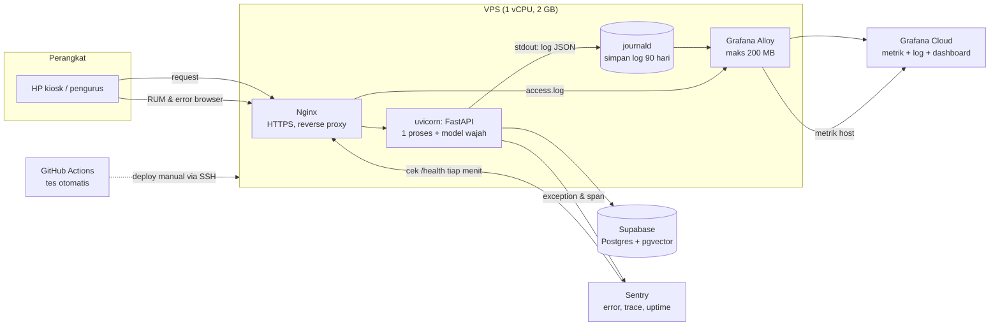

# Panduan DevOps KP Hub

**Untuk:** Jose. Ditulis untuk orang yang belum pernah mengurus server produksi.
**Status:** 26 September 2026, bersamaan dengan branch `feature/v3-f0-observability`.

Dokumen ini punya tiga tujuan: menjelaskan konsepnya, menjelaskan kenapa alat-alat ini yang dipilih untuk KP, dan memberi urutan kerja yang aman. Bagian 6 berisi review saya atas semua keputusan subagent: apa yang saya setujui, apa yang saya ubah urutannya, dan apa yang saya tunda.

---

## 1. Gambaran besar: lima hal yang sering tercampur

DevOps adalah semua pekerjaan di antara "kodenya sudah jadi di laptop" dan "orang bisa memakainya dengan tenang setiap Sabtu". Untuk KP, pekerjaan itu terbagi menjadi lima bagian dengan fungsi berbeda:

| Bagian | Pertanyaan yang dijawab | Analogi | Di proyek ini |
|---|---|---|---|
| **CI** (Continuous Integration) | "Apakah perubahan ini merusak sesuatu?" | Pemeriksaan kendaraan sebelum berangkat | GitHub Actions menjalankan 146 tes di setiap push |
| **CD** (Continuous Delivery/Deployment) | "Bagaimana kode baru sampai ke server dengan aman?" | Kurir yang mengantar, dengan jalan balik kalau salah alamat | Sekarang: SSH + `git pull` manual. Nanti: tombol di GitHub |
| **Logging** | "Apa persisnya yang terjadi pukul 17:20?" | Buku harian atau rekaman CCTV | Log JSON → journald → Grafana Loki |
| **Metrik** | "Seberapa sehat server secara umum, dari waktu ke waktu?" | Termometer dan detak jantung | Alloy → Grafana Cloud (RAM, CPU, swap) |
| **Error tracking & tracing** | "Error apa yang muncul, dan tahap mana yang lambat?" | Laporan kecelakaan beserta rekaman perjalanannya | Sentry |

Ditambah dua hal yang menempel ke semuanya:
- **Uptime monitoring:** pihak luar mengecek situs setiap menit, persis seperti yang dilakukan HP jemaat.
- **Alerting:** kalau ada yang salah, HP Anda berbunyi. Jangan sampai tahunya dari chat panitia.

Kenapa semua ini perlu, bukan sekadar "bagus kalau ada"? Kasus Gibbor adalah contohnya. Kita butuh satu minggu dan penggalian log manual untuk menjawab pertanyaan yang semestinya terjawab dalam 15 menit dari dashboard. Separuh jawabannya bahkan hampir hilang karena log nginx dihapus otomatis setelah 14 hari.

---

## 2. Arsitektur setelah Fase 0



Cara membacanya:
1. **Jalur utama (garis tebal kiri ke kanan):** HP → Nginx → aplikasi → Supabase. Semua yang lain adalah *pengamat* jalur ini dan tidak boleh mengganggunya. Karena itu Alloy dibatasi memorinya, dan semua kode observability dibungkus supaya kegagalannya tidak menjatuhkan request.
2. **Log keluar lewat stdout.** Aplikasi tidak menulis file log sendiri. Ia hanya mencetak ke layar (stdout), lalu systemd menangkapnya ke journald. Ini praktik standar ("12-factor app"): aplikasi tidak perlu tahu log disimpan di mana, dan penyimpanan bisa diganti tanpa mengubah kode.
3. **Dua salinan log.** Di server (journald, 90 hari) dan di Grafana Cloud (14 hari, tetapi bisa dicari dan digrafikkan). Kalau Grafana bermasalah atau akun gratisnya berubah, log di server tetap ada.
4. **Data performa dari HP (RUM)** masuk ke tabel Supabase `client_perf`, bukan ke Sentry. Alasannya ada di §3.6.

---

## 3. Setiap komponen: apa, kenapa, alternatifnya

### 3.1 Log terstruktur (JSON)

**Apa.** Setiap request menghasilkan satu baris seperti ini:

```json
{"ts":"2026-09-26T10:20:00Z","level":"info","logger":"kp.request","request_id":"64e44f13c38242c9","device":"kiosk-03","method":"POST","route":"/api/recognize","status":200,"duration_ms":412.5}
```

Setiap check-in juga menghasilkan satu baris `kp.checkin` berisi hasilnya (`success`, `unknown_face`, `geofence_rejected`, dan seterusnya) dan waktu per tahap (`embedding`, `match`, `insert`). Setiap pendaftaran menghasilkan satu baris `kp.register` berisi alasan penolakannya.

**Kenapa JSON, bukan teks biasa.** Log teks seperti `INFO: 114.5.104.153:0 - "POST /api/register" 500` bisa dibaca manusia, tetapi sulit diolah mesin. Pertanyaan seperti "berapa p95 waktu check-in di kiosk-03 antara 17:00 dan 17:30" membutuhkan field yang terpisah rapi, dan itu yang diberikan JSON.

**Istilah yang perlu dikenal:**
- **`request_id`**: nomor unik per request. Kalau kiosk melaporkan error, nomor ini menghubungkan baris log, event Sentry, dan keluhan panitia.
- **`device`**: label kiosk (`?device=kiosk-03` di URL saat perangkat disiapkan). Tanpa label ini, 16 HP di log hanya terlihat sebagai deretan IP operator seluler yang berganti-ganti.
- **p95**: 95% request lebih cepat dari angka ini. Rata-rata menyesatkan: 90 check-in cepat dan 10 check-in yang macet 60 detik bisa tetap menghasilkan rata-rata yang terlihat "wajar".

**Yang sengaja tidak dicatat:** nama, nomor HP, foto, dan koordinat GPS. Log berpindah tangan (ke Grafana Cloud, ke laptop saat forensik), jadi isinya harus aman kalau bocor.

### 3.2 journald: penyimpanan log di server

**Apa.** Layanan bawaan Ubuntu yang menyimpan semua keluaran layanan systemd. Perintah yang paling sering dipakai:

```bash
sudo journalctl -u faceid -n 50 --no-pager                      # 50 baris terakhir
sudo journalctl -u faceid --since "17:00" --until "17:30"        # jendela waktu
sudo journalctl -u faceid -f                                     # ikuti langsung (Ctrl+C untuk berhenti)
```

**Keputusan:** 90 hari, maksimal 1 GB, dan selalu menyisakan 2 GB disk kosong (`scripts/ops/journald-retention.conf`). Bawaan Ubuntu dibatasi ukuran, bukan umur, dan tidak menjamin log tersimpan setelah reboot. Kasus Gibbor menunjukkan bahwa kita baru mencari log seminggu setelah kejadian. Tiga bulan memberi ruang yang aman.

### 3.3 Metrik host dan Grafana Alloy

**Apa itu metrik.** Angka yang diukur berkala, misalnya "RAM tersedia = 895 MB" setiap 60 detik. Berbeda dengan log yang mencatat kejadian, metrik mencatat keadaan. Metrik sangat murah disimpan dan bagus untuk grafik tren.

**Metrik yang paling penting untuk server KP:**

| Metrik | Artinya | Kapan khawatir |
|---|---|---|
| `MemAvailable` | RAM yang masih bisa dipakai | < 200 MB |
| Swap used | RAM yang "dipinjam" dari disk (jauh lebih lambat) | Naik terus saat ibadah |
| CPU usage | Kesibukan prosesor | 100% terus-menerus saat antrean |
| Load average | Jumlah pekerjaan yang antre di CPU | Di 1 vCPU, **di atas 1 berarti ada antrean** |
| Disk free | Ruang disk | < 15% |

**Alloy** adalah agen kecil dari Grafana yang berjalan di server. Tugasnya membaca metrik host dan log journald/nginx, lalu mengirim keduanya ke Grafana Cloud. Satu agen untuk dua pekerjaan.

**Grafana Cloud (free tier)** menyimpan dan menampilkan data. Di dalamnya ada dua "database" khusus: **Prometheus/Mimir** untuk metrik dan **Loki** untuk log. Batas gratisnya (diverifikasi subagent dari dokumentasi resmi): 10 ribu series metrik, 50 GB log per bulan, retensi 14 hari. Kebutuhan KP jauh di bawah batas itu.

**Soal "label" dan cardinality.** Ini konsep Loki yang paling sering menjebak pemula. Loki mengelompokkan log berdasarkan *label*. Setiap kombinasi label unik menjadi satu "aliran" terpisah. Jika `request_id` dijadikan label, setiap request membuat aliran baru, dan Loki menjadi lambat atau menolak data. Aturannya: label hanya untuk nilai yang jumlahnya sedikit (`logger`, `level`), sedangkan sisanya tetap di dalam JSON dan disaring saat mencari. Konfigurasi Alloy sudah mengikuti aturan ini.

**Alternatif yang dipertimbangkan:**
- **Netdata**: satu perintah install dengan dashboard bagus, tetapi terpisah dari log. Kita akan punya dua tempat untuk dilihat.
- **Prometheus + Grafana dipasang sendiri di VPS**: gratis sepenuhnya, tetapi memakan RAM dan CPU di server yang sama yang sedang kita coba selamatkan. Tidak cocok untuk 1 vCPU.
- **Tidak memakai apa pun, cukup `/health`**: `/health` sekarang sudah menampilkan RAM dan swap. Tetapi itu hanya kondisi *saat ini*, tanpa riwayat. Pertanyaan "apa yang terjadi pukul 17:20?" tidak bisa dijawab.

### 3.4 Sentry: error, trace, uptime

Sentry sudah dipakai sejak sebelum Fase 0. Yang ditambahkan:
- **Span per tahap check-in**: `face.embedding`, `face.match`, `db.check_today`, `db.insert`, dan seterusnya. Satu request yang lambat bisa dibuka seperti rekaman, lalu terlihat tahap mana yang memakan waktu. Sample rate 10%: hanya 1 dari 10 request yang direkam penuh, supaya kuota gratis tidak habis. Error tetap dikirim 100%.
- **Tag `request_id` dan `device`** di setiap event.
- **Satu event per menit per endpoint untuk 429**, supaya lonjakan rate limit kelihatan tanpa membanjiri kuota.

**Beda Sentry dan Loki.** Sentry mengelompokkan *error yang sama* menjadi satu "issue" lengkap dengan stack trace dan jumlah kejadian. Loki menyimpan *semua* baris log. Sentry untuk "ada yang rusak, apa?", Loki untuk "ceritakan semua yang terjadi pukul 17:20."

### 3.5 Uptime monitoring dan alerting

**Kenapa harus dari luar.** Kalau server mati, server itu tidak bisa mengirim kabar bahwa dirinya mati. Pengecek dari luar juga membedakan dua situasi yang di Gibbor terlihat sama: server down, atau jaringan venue yang bermasalah.

**`/health` membalas 503 saat database atau model wajah bermasalah**, bukan hanya saat proses mati. Jadi pengecek akan berbunyi juga saat server hidup tetapi absensi lumpuh.

**Aturan alert yang saya sarankan (sedikit tapi penting):**
1. `/health` gagal 2 kali berturut-turut → email/HP. **Ini wajib.**
2. Error rate 5xx > 5% selama 5 menit → email. Dipasang setelah Grafana jalan.
3. RAM tersedia < 200 MB selama 5 menit → email. Dipasang setelah Grafana jalan.

Jangan pasang lebih dari itu dulu. Alert yang terlalu sering berbunyi akan diabaikan ("alert fatigue"). Alert yang diabaikan lebih buruk daripada tidak ada alert, karena memberi rasa aman palsu.

### 3.6 RUM: data performa dari HP pengguna

**Apa.** Real User Monitoring: setiap halaman mengukur dirinya sendiri di HP pengguna, lalu mengirim hasilnya ke `/api/rum`. Yang diukur antara lain waktu muat (LCP), jumlah dan lama "macet" (long task), resource CDN yang paling lambat, RAM perangkat, dan jenis jaringan.

**Kenapa ke tabel Supabase, bukan Sentry.** Pertanyaan yang ingin dijawab bersifat agregat: "HP dengan RAM ≤ 3 GB, p75 LCP-nya berapa?" SQL adalah alat terbaik untuk itu, dan volumenya kecil (maksimal 10 kiriman per halaman per HP). Mengirim semuanya ke Sentry akan cepat menghabiskan kuota gratis. Hanya halaman yang *sangat* lambat yang dilaporkan ke Sentry, maksimal sekali per jam per perangkat.

**Keterbatasan yang perlu diketahui:** Safari (iPhone) tidak mendukung sebagian besar metrik ini, jadi datanya kosong untuk iPhone. Itu wajar, bukan bug.

### 3.7 CI: GitHub Actions

`.github/workflows/qa.yml` sudah menjalankan tes di setiap push ke `dev`, `staging`, dan `main`, serta di setiap pull request. Tes backend berjalan dulu, lalu server dinyalakan dan diuji dengan Playwright (browser sungguhan).

Dua tes baru dari Fase 0 layak dipahami karena mencegah Gibbor terulang:
- **`tests/test_no_blocking_io.py`** memanggil **semua 35 endpoint** dan gagal jika ada yang menyentuh database dari event loop. Tes ini juga gagal kalau ada endpoint baru yang belum masuk daftar ujinya. Jadi kesalahan yang menyebabkan Gibbor tidak bisa masuk lagi tanpa ketahuan.
- **`tests/test_db_client.py`** memastikan client Supabase memakai HTTP/1.1, batas waktu 10 detik, dan aturan coba-ulang yang aman.

### 3.8 CD: deploy

**Kondisi sekarang.** SSH ke server, `git pull`, lalu restart manual. Pipeline otomatis di `qa.yml` (job `deploy`) sudah ditulis tetapi belum pernah dipakai, dan **tidak akan berhasil** di server Anda karena `scripts/remote_update.sh` mencari aplikasi di `/var/www/faceID-KP`.

**Yang sudah bagus dari desain pipeline itu:**
- Deploy hanya berjalan kalau tes hijau.
- Deploy tidak otomatis. Harus menekan tombol "Run workflow", kecuali variabel `AUTO_DEPLOY` dinyalakan.
- Kunci SSH deploy dikunci ke satu script saja. Kalau bocor, pencuri hanya bisa memicu deploy ulang, tidak bisa membuka shell.
- **Rollback otomatis:** kalau `/health` tidak hijau dalam 90 detik setelah restart, versi sebelumnya dikembalikan.

**Konsep penting: setiap deploy = kiosk mati sebentar.** Hanya ada satu proses, dan model wajah perlu dimuat ulang (belasan sampai puluhan detik). Karena itu deploy **tidak boleh** dilakukan Sabtu 15:00–19:30 atau saat acara. Aturan ini sebaiknya ditegakkan oleh script, bukan diingat-ingat (lihat §6).

**Staging.** Staging adalah server kedua yang identik dengan produksi, tempat menguji sebelum rilis. Untuk skala KP, biaya dan perawatannya belum sebanding. Penggantinya: tes otomatis, deploy di malam hari kerja, rollback otomatis, dan uptime monitor yang langsung berbunyi.

---

## 4. Kenapa server membeku saat Gibbor

Bagian ini menjelaskan konsep yang paling penting untuk dipahami dari seluruh kejadian.

**Event loop.** Server FastAPI dengan uvicorn melayani banyak request dengan **satu** "petugas utama" (event loop). Petugas ini cepat karena tidak pernah menunggu: begitu sebuah request perlu menunggu (misalnya jawaban database), ia titipkan dulu lalu melayani request berikutnya. Syaratnya, penantian itu harus dilakukan dengan cara yang "bisa dititipkan" (`await` pada operasi async), atau dikerjakan di **thread pool** (tim pembantu, lewat `run_in_threadpool`).

**Apa yang salah.** Library Supabase yang kita pakai bersifat *sinkron*: ia menunggu dengan cara memblokir. Handler `/api/register` memanggilnya langsung dari petugas utama. Selama query berjalan, petugas utama berdiri diam menunggu, dan **semua** request lain ikut antre, termasuk halaman kiosk dan file `.js`. Lalu koneksi HTTP/2 ke Supabase rusak, dan batas tunggu bawaannya 120 detik. Petugas utama bisa berdiri diam sampai dua menit. Setelah 60 detik Nginx menyerah (504), dan pengguna menutup halaman (499).

**Perbaikannya:**
1. Semua panggilan database dipindah ke thread pool, atau handler-nya diubah menjadi `def` biasa. FastAPI otomatis menjalankan handler `def` di thread pool.
2. Koneksi ke Supabase memakai HTTP/1.1 (satu koneksi rusak hanya menggagalkan satu request), dengan batas waktu 10 detik.
3. Coba ulang sekali untuk gangguan jaringan, tetapi untuk operasi tulis hanya kalau request *pasti* belum sampai ke server. Mengulang insert yang ternyata sudah tersimpan akan membuat anggota kembar. Operasi yang aman diulang disebut **idempoten**.

**Kenapa tidak cukup menambah worker.** Server hanya punya 1 vCPU. Worker kedua berarti proses kedua dengan salinan model wajah kedua (sekitar 1 GB RAM), padahal jumlah prosesornya tetap satu. Masalahnya bukan kekurangan tenaga, tetapi satu-satunya petugas dibuat berdiri diam.

---

## 5. Istilah

| Istilah | Arti singkat |
|---|---|
| Reverse proxy | Nginx menerima semua request dari luar, mengurus HTTPS, lalu meneruskannya ke aplikasi |
| 499 / 504 | 499: pengguna menyerah sebelum dijawab (kode khas nginx). 504: aplikasi tidak menjawab dalam batas waktu nginx |
| Worker | Satu proses aplikasi. Lebih banyak worker = lebih banyak proses paralel, dan lebih banyak RAM |
| Thread pool | Sekelompok thread pembantu untuk pekerjaan yang memblokir, supaya event loop tetap bebas |
| Idempoten | Aman dijalankan dua kali (SELECT: ya; INSERT tanpa penjaga unik: tidak) |
| SLO | Target layanan yang disepakati, misalnya "tersedia 99,5% selama jendela ibadah" |
| Retensi | Berapa lama data disimpan sebelum dihapus otomatis |
| Cardinality | Jumlah kombinasi nilai label yang unik; terlalu tinggi membuat Loki lambat |
| Rollback | Kembali ke versi sebelumnya saat deploy gagal |
| Drop-in | File konfigurasi kecil yang menimpa sebagian konfigurasi bawaan tanpa mengubah file aslinya |

---

## 6. Review keputusan

### Disetujui tanpa perubahan
- **Log JSON ke stdout + journald 90 hari.** Standar industri, murah, tidak bergantung pada pihak ketiga.
- **Label Loki hanya `logger` dan `level`.** Benar soal cardinality.
- **Alloy dengan `MemoryMax=200M` dan `OOMScoreAdjust=500`.** Kalau memori habis, monitoring yang dikorbankan lebih dulu, bukan absensi. Ini prioritas yang tepat.
- **Perbaikan event loop + tes pengaman.** Ini inti dari seluruh fase dan sudah dibuktikan dengan uji lokal: `GET /` saat pendaftaran lambat turun dari 3.763 ms ke 6 ms.
- **Aturan coba-ulang yang membedakan baca dan tulis.** Konservatif di tempat yang tepat.
- **Saklar fitur menyimpan nilai terakhir yang berhasil dibaca** saat Supabase gagal. Ini lebih aman daripada kembali ke `.env`, yang bisa tiba-tiba menyalakan geofence saat retret.

### Disetujui, urutannya saya ubah
Subagent menyusun urutan 1–7 di `scripts/ops/README.md`. Untuk orang yang baru belajar, saya sarankan urutan yang memberi manfaat terbesar dengan risiko terkecil lebih dulu:

1. **Uptime monitor Sentry** (15 menit, di web, tanpa menyentuh server). Pilih **satu** dulu: Sentry, karena sudah terpakai dan intervalnya 1 menit. UptimeRobot opsional, kalau Anda ingin notifikasi Telegram.
2. **Retensi journald** (5 menit).
3. **Deploy branch ini** (§7), karena log JSON baru ada setelah deploy.
4. **Format log nginx** (10 menit). Ini suntingan manual di konfigurasi HTTPS, jadi lakukan saat kepala segar.
5. **Alloy + Grafana Cloud + dashboard** (30–60 menit). Ini paling kompleks, jadi dikerjakan terakhir setelah langkah lain stabil.

`collect_incident.sh` untuk Gibbor tidak lagi mendesak karena log mentahnya sudah Anda amankan di `/root/gibbor-2026-09-19`. Tetap jalankan sebelum 3 Oktober untuk mendapat `SUMMARY.txt` lengkap.

### Perlu diubah (belum dikerjakan, menunggu persetujuan)
1. **Script deploy yang tidak cocok dengan server.**
   - `scripts/deploy_vps.sh` membuat 2 worker gunicorn di `/var/www` dan menimpa konfigurasi HTTPS nginx. Script ini **berbahaya** kalau dijalankan di server sekarang. Saran: tulis ulang agar sesuai kondisi nyata (1 proses uvicorn di `/home/adminKPBromo/faceID-KP`), atau tandai jelas sebagai "hanya untuk server baru".
   - `scripts/remote_update.sh`: ganti jalur bawaannya, lalu tambahkan **penjaga jendela ibadah**. Script menolak deploy Sabtu 15:00–19:30 WIB, kecuali dipaksa dengan flag khusus.
2. **Versi dependency tidak dikunci.** `requirements.txt` tidak mencantumkan versi. Server bisa memakai versi Supabase yang berbeda dari laptop dan CI. Perbaikan client Supabase membutuhkan `ClientOptions(httpx_client=...)`, yang tersedia di supabase 2.28 (versi di laptop). Kalau versi di server lebih lama, aplikasi bisa gagal start. Saran: kunci versi (`supabase==2.28.0`, `httpx==0.28.1`, dan seterusnya).
3. **Versi Python berbeda di tiga tempat.** Laptop 3.9, CI 3.10, server 3.12. Tes yang lolos di CI belum tentu berperilaku sama di server. Saran: CI dan laptop ikut 3.12.
4. **Dashboard 25 panel terlalu banyak untuk awal.** Setelah Sabtu pertama berjalan, pilih 6 panel yang benar-benar dilihat (RAM, CPU/load, request per status, p95 check-in, hasil check-in, error), lalu pindahkan sisanya ke baris yang dilipat.
5. **Pendaftaran menyimpan kehadiran tanpa `method`.** Ini melanggar aturan `checkin_method` di CLAUDE.md dan sudah terjadi sejak sebelum Fase 0. Perlu keputusan Anda: apakah kehadiran dari pendaftaran dicatat `'face'`, atau perlu nilai ketiga seperti `'registration'`?

### Ditunda ke Fase 1
- Uji beban skenario acara besar.
- Antrean prioritas: check-in didahulukan, pendaftaran menunggu giliran CPU.
- Evaluasi model wajah yang lebih ringan.
- Paginasi `/api/all-logs`.
- Menghidupkan deploy lewat GitHub Actions. Sebelum itu, `remote_update.sh` perlu diperbaiki, lalu satu uji coba di malam hari kerja.

---

## 7. Deploy branch ini (manual, cara yang sudah Anda kenal)

Lakukan di **malam hari kerja**, bukan Sabtu.

```bash
# 0. Di Supabase SQL Editor: jalankan isi scripts/2026-09-26_client_perf.sql
#    (tanpa ini RUM tetap aman, tetapi datanya tidak tersimpan)

# 1. Masuk server dan cek versi library yang terpasang
ssh <user>@<ip-vps>
cd /home/adminKPBromo/faceID-KP
./venv/bin/pip show supabase httpx | grep -E "Name|Version"

# 2. Ambil kode dan samakan dependency
git pull
./venv/bin/pip install -r requirements.txt
./venv/bin/pip install "supabase==2.28.0" "httpx==0.28.1"    # jika langkah 1 menunjukkan versi lebih lama

# 3. Restart dan tunggu sehat
sudo systemctl restart faceid
sleep 20; curl -s http://127.0.0.1:8000/health; echo

# 4. Pastikan log JSON muncul
sudo journalctl -u faceid -n 20 --no-pager
```

Jika `/health` tidak menjawab setelah 60 detik:

```bash
sudo journalctl -u faceid -n 80 --no-pager    # baca errornya
git log --oneline -2                          # catat commit sebelumnya
git checkout <commit-sebelumnya> && sudo systemctl restart faceid
```

Setelah itu, buka kiosk dengan `?device=kiosk-uji`, lakukan satu check-in, lalu cari barisnya:

```bash
sudo journalctl -u faceid --since "5 min ago" --no-pager | grep kp.checkin
```
