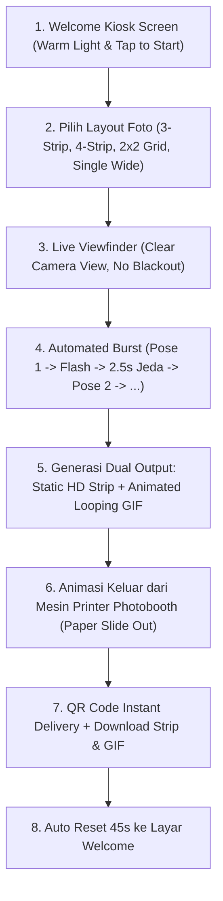

# 📸 Product Requirements Document (PRD): Nusantara Festive Photobooth Kiosk (KP Bromo)

## 📌 1. Vision & Background
Photobooth KP Bromo dirancang sebagai sarana perayaan dan dokumentasi kebersamaan anak muda Komisi Pemuda GKI Bromo Malang dalam rangka menyambut **HUT RI ke-81 / Perayaan Kemerdekaan Indonesia yang merayakan Keberagaman Budaya Nusantara (Bhinneka Tunggal Ika)**.

Sistem ini berorientasi pada **Kiosk Bersama** (tablet/touchscreen/laptop) dengan antarmuka yang cerah (*Warm Light Editorial Paper*), minimalis, tactile, dan bebas dari kebingungan opsi filter/tema rumit.

---

## 🎨 2. Design System: "Nusantara Festive Light"

### A. Filosofi Visual
* **Mode:** Light Mode (*Warm Ivory / Textured Paper Base*). Menghapus gaya dark mode terminal yang kaku.
* **Karakter:** Hangat, ceria, minimalis, dan merayakan keberagaman kain & motif nusantara (Batik, Tenun, Songket, Merah-Putih) secara modern (bukan desain spanduk jadul).
* **Tipografi:** *Space Grotesk* (Display/Heading tebal) + *Plus Jakarta Sans* (Body) + *JetBrains Mono* (Stempel tanggal & metadata).

### B. Design Tokens
```css
:root {
  /* Canvas & Surfaces */
  --bg-canvas: #FAF7F2;          /* Warm Ivory / Textured Craft Paper */
  --bg-card: #FFFFFF;            /* Pure Crisp White Card */
  --bg-subtle: #F3ECE2;          /* Subtle Warm Sand */
  
  /* Indonesian Cultural Accents */
  --color-crimson: #DC2626;       /* Merah Kemerdekaan */
  --color-terracotta: #C2410C;    /* Tanah Liat & Tenun Tradisional */
  --color-ochre-gold: #D97706;    /* Emas Warisan Nusantara */
  --color-forest-sage: #047857;   /* Hijau Alam Khatulistiwa */
  --color-royal-indigo: #1E3A8A;  /* Biru Bahari Kepulauan */
  
  /* Borders & Shadows */
  --border-hairline: 1.5px solid #E6DDD0;
  --border-chunky: 2.5px solid #1E1B18;
  --shadow-tactile: 4px 4px 0px #1E1B18;
  --shadow-paper: 0 10px 30px -5px rgba(30, 27, 24, 0.08);
}
```

---

## 🔄 3. Alur Pengguna (User Flow & Interactions)



---

## ⚙️ 4. Spesifikasi Fitur Utama

### 1. Viewfinder Bening (Tanpa Blackout Overlay)
* Saat hitung mundur 3s / 5s berjalan, **layar kamera tetap 100% terang dan jernih**.
* Angka hitungan mundur ditampilkan sebagai **badge mengambang (*floating pill/circle badge*) beranimasi** di atas sudut kamera sehingga jemaat leluasa menata rambut dan pose wajah.

### 2. Pilihan Layout Photobooth (Bukan Filter/Tema Rumit)
Pengguna hanya memilih format cetak di awal:
1. **3-Strip Vertikal** (3 Pose — Standar Studio Populer)
2. **4-Strip Vertikal** (4 Pose — Format Klasik)
3. **2x2 Bento Grid** (4 Pose Kotak)
4. **Single Wide Polaroid** (1 Pose Lebar untuk Grup Besar)

### 3. Dual Output: High-Res Photo Strip + Animated Looping GIF
* **Static HD Strip (300 DPI):** Format cetak jernih berornamen kemerdekaan nusantara.
* **Animated Looping GIF (Stop-Motion / Boomerang):** Merangkai frame pose yang diambil menjadi animasi GIF berulang secara instan menggunakan client-side encoder ringan.

### 4. Skeuomorphic "Printing Slide-Out" Animation
* Setelah pemotretan selesai, muncul animasi visual slot mesin cetak di bagian atas.
* Lembaran foto strip meluncur turun secara halus (*slide down*) dengan efek bayangan kertas dan efek suara mesin potong foto.

### 5. Folder Aset Khusus Elemen 17an (`frontend/assets/photobooth/`)
* Struktur folder:
  * `frontend/assets/photobooth/stickers/` : Kumpulan stiker transparan PNG (pita, lencana, bendera, ornamen adat).
  * `frontend/assets/photobooth/frames/` : Overlay border & motif kain nusantara.
* Sistem otomatis membaca dan merender aset-aset dari direktori tersebut ke canvas.

---

## 🧪 5. Quality Assurance & TDD Plan
* **Unit Tests:** Pengujian pembuatan file strip JPEG, GIF stop-motion buffer, dan endpoint `/api/photobooth/upload`.
* **Playwright E2E:** Pengujian alur pemilihan layout, countdown tanpa blackout, animasi mesin printer, dan modal QR Code.
* **Audit Strictness:** 0 Unicode emoji mentah (hanya SVG vector stroke).
