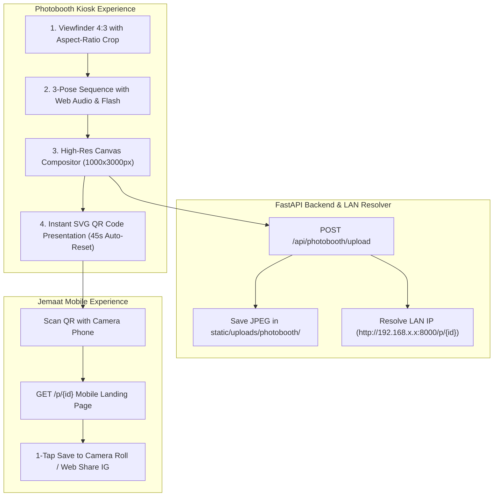

# 📸 Superpower Plan: KP45 Gen-Z Photo Strip Booth & Neo-Brutalist Tactile UI

## 🎯 Executive Summary & Design Vision
Mengintegrasikan seluruh superpower skill ([`ui-ux-pro-max`](file:///Users/josetaneo/.agents/skills/ui-ux-pro-max/SKILL.md), [`design-system`](file:///Users/josetaneo/.agents/skills/design-system/SKILL.md), [`ui-styling`](file:///Users/josetaneo/.agents/skills/ui-styling/SKILL.md), dan [`anti-ai-slop-indonesian-writing`](file:///Users/josetaneo/.agents/skills/anti-ai-slop-indonesian-writing/SKILL.md)) untuk merombak total Photobooth KP Bromo dari antarmuka digital standar menjadi **pengalaman Self-Photo Studio / Y2K Photomatix yang sangat tactile, ceria, autentik khas pemuda, dan berenergi tinggi untuk festival 17 Agustusan**.

---

## 🎨 Token Architecture & Design System Specification

### 1. Color Palette (Neo-Brutalist & Tactile Youth)
* **Canvas Dark Canvas:** `#0A0D14` (Deep Charcoal Blue)
* **Card Surface:** `#121624` with `border-2 border-white/15`
* **Solid Tactile Drop Shadows:** `shadow-[4px_4px_0px_#000000]` / `shadow-[6px_6px_0px_#2563EB]`
* **Vibrant Accent Colors:**
  * 🔴 **Crimson Pop:** `#EF4444` / `#DC2626` (Merah Kemerdekaan)
  * 🟡 **Neon Sunflower:** `#FBBF24` / `#F59E0B` (Aksen Stiker Ceria)
  * 🔵 **Electric Azure:** `#3B82F6` / `#2563EB` (Aksi Utama & Kiosk Glow)
  * 🟣 **Pastel Lilac:** `#C4B5FD` / `#8B5CF6` (Y2K Photomatix Accent)
  * 🟢 **Mint Lime:** `#10B981` (Status Aktif)
  * 📄 **Photo Paper Base:** `#FFFDF8` (Warm Cream White)

### 2. Micro-Interactions & Tactile Button Physics
* **Button Normal:** `translate-y-0 shadow-[4px_4px_0px_#000000]`
* **Button Hover:** `-translate-y-0.5 shadow-[6px_6px_0px_#000000]`
* **Button Press (Active):** `translate-y-1 translate-x-1 shadow-[1px_1px_0px_#000000]`
* **Bouncy Shutter Feedback:** Audio sintesis multi-frekuensi (Web Audio API) + Animasi Shutter Aperture.

---

## 🖼️ 4 Bespoke Canvas Strip Compositor Themes (300 DPI High-Res)

1. 🇮🇩 **Merah Putih Festive 17an (Playful Independence):**
   * Background: Warm Cream (`#FFFDF8`) dengan border bergelombang (*scalloped*) merah merona.
   * Ornamen: Lencana stiker "17 AGUSTUS", pita kemerdekaan, bintang stiker kuning neon, stempel "DIRGAHAYU REPUBLIK INDONESIA", dan footer Komisi Pemuda GKI Bromo.
   * Frame Foto: 3 slot foto rounded tebal dengan bayangan fisik solid.

2. 🇰🇷 **Y2K Photomatix Seoul (Cute Pastel Aesthetic):**
   * Background: Gradien pastel lilac ke baby blue (`#F5F3FF` &rarr; `#EFF6FF`).
   * Ornamen: Stiker doodle bintang, bunga retro, teks stempel vertikal ala stiker photobooth Korea, barcode minimalis, dan timestamp monospaced.

3. ⚜️ **Nusantara Heritage Batik (Modern Terracotta & Gold):**
   * Background: Tekstur kertas kraft/latte hangat dengan ornamen batik geometris modern pada sudut-sudut kartu.
   * Ornamen: Border emas klasik, cap stempel vintage, dan tipografi serif berwibawa.

4. 🎞️ **Retro Kodachrome 1945 (Analog Film Strip):**
   * Background: Film strip hitam/slate gelap dengan lubang perforasi film di sisi kiri dan kanan (*film sprockets*).
   * Ornamen: Tipografi mesin ketik monospaced (`SAFETY FILM 1945`, `FRAME 01A`, `ISO 400`), time-code, dan efek grain analog.

---

## 🛠️ TDD & Architecture Plan

### 📋 TDD Execution Checklist:
- [ ] **Test 1 (API Unit Test):** Validasi upload base64 JPEG, pembuatan UUID, direktori upload, dan respon JSON.
- [ ] **Test 2 (Mobile View Test):** Validasi `GET /p/{id}` dengan status 200, tombol simpan foto, dan penanganan 404 jika berkas tidak ditemukan.
- [ ] **Test 3 (Playwright E2E UI Test):**
  - Uji pergantian 4 tema bingkai foto (*Merah Putih, Y2K Pastel, Batik Nusantara, Retro Film*).
  - Uji filter warna (*Natural, Warm Vintage, B&W Contrast, Soft Pastel*).
  - Uji interaksi tombol tactile (hover & active states).
  - Uji alur capture 3 pose, countdown, flash, dan kemunculan modal QR Code.
  - Assert 0 browser console errors.
