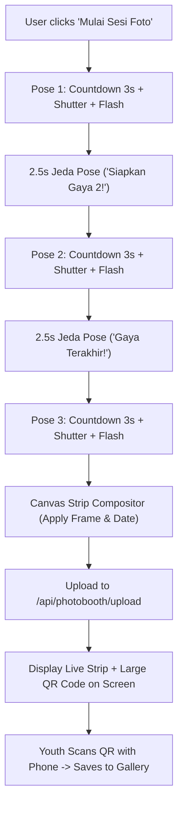

# 📸 Implementation Plan: KP45 Gen-Z Photo Strip Photobooth & Instant QR Transfer

## 🎯 Executive Summary & Objectives
Transform the existing single-shot photobooth into a high-engagement, **Gen-Z vertical Photo Strip experience** (3-4 sequential poses with automated countdown) styled with **playful 17 Agustusan & Indonesian youth themes**. It operates as a **standalone kiosk** with **instant QR Code delivery**, allowing youth attendees to scan the kiosk screen with their phones and instantly download their photo strip to their mobile camera roll.

---

## 🔍 Critical Analysis & Architecture Risks (Engineering Scrutiny)
1. **Localhost vs Mobile QR Resolution Risk:**
   * *The Trap:* Generating a QR code pointing to `http://localhost:8000/p/xyz` means smartphones scanning the screen will fail to connect.
   * *Resolution:* The backend dynamically resolves the host's local network IP (`http://<LAN_IP>:8000/p/{id}`) or allows configuring a base URL via `.env` (`PHOTOBOOTH_BASE_URL`), with graceful fallback.
2. **Camera Aspect Ratio Distortion:**
   * *The Trap:* Different devices (MacBook FaceTime HD 16:9, iPad 4:3, USB Webcams) will stretch or squish portraits in the strip frames if not properly cropped.
   * *Resolution:* Implement intelligent center-crop bounding algorithms (`drawImage` source cropping) to enforce perfect, undistorted 4:3 ratio photo slots.
3. **Session Timing & Kiosk Queue Congestion:**
   * *The Trap:* If users spend too long tweaking stickers or re-shooting at the kiosk, long queues will form before fellowship begins.
   * *Resolution:* Fast 3-pose burst flow (3s countdown -> flash -> 2.5s pose change -> repeat), automated strip assembly, instant QR presentation, and 45s auto-reset countdown.

---

## 🛠️ User Review Required

> [!IMPORTANT]
> **Key Architectural Decisions to Confirm:**
> 1. **Default Pose Count:** 3 sequential vertical photos per strip (standard 2x6 photobooth strip).
> 2. **Storage Strategy:** Photos saved locally in `static/uploads/photobooth/` and accessible via instant mobile download link `/p/{id}`.
> 3. **QR Code Engine:** Standalone client-side SVG QR code generator (zero external network dependency).

---

## 📐 Technical Specifications & UI Flow

### 1. Multi-Shot Sequence (Capture Loop)

### 2. Indonesian & 17 Agustusan Playful Frames
1. **Merah Putih Cute Fest (17an Pop):**
   * Vibrant red & white borders with wavy playful lines, cute Indonesian independence badges, "17 AGUSTUS • DIRGAHAYU", and "KP BROMO".
2. **Batik Pop Nusantara (Kawaii Heritage):**
   * Modern pastel gold & terracotta batik motifs, cute stamp icons, and traditional geometric ornaments.
3. **Retro Kodachrome 1945:**
   * Vintage film grain border, nostalgic typewriter typography, and retro date stamp.
4. **Obsidian Cyber Youth (Classic Deep):**
   * Sleek dark obsidian frame with cyan/azure neon accents for modern church events.

### 3. Backend Endpoints (`routers/photobooth.py`)
* `POST /api/photobooth/upload`: Receives base64/JPEG photo strip, generates short unique UUID, saves image, returns mobile download URL & QR payload.
* `GET /p/{photo_id}`: Clean, high-conversion mobile download page optimized for iOS Safari & Android Chrome with a 1-tap "Download Foto Strip" button.
* `GET /api/photobooth/recent`: Admin feed to inspect recent photobooth sessions.

---

## 📋 Verification & Testing Protocol
* **Unit & API Tests:** Test upload endpoint payload validation, image integrity, and mobile redirect.
* **E2E Playwright Tests:**
  * Multi-pose capture sequence test.
  * Canvas strip generation verification.
  * QR Code modal visibility and download page rendering.
* **100% Zero-Emoji Verification:** Automated scan on all new `.html` and `.js` files.
